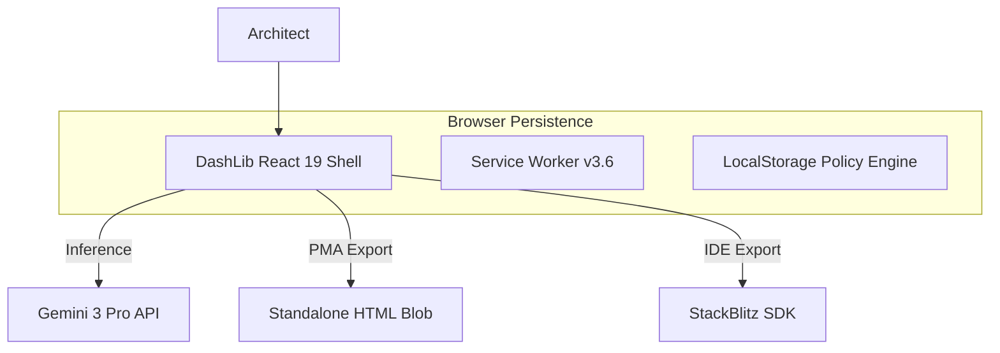

# 🏛️ System Architecture (v3.6)

DashLib AI is a client-centric, AI-augmented Single Page Application (SPA) designed for zero-install portability.

---

## 1. High-Level System Context

## 2. The Portable Micro-App (PMA) Strategy
Introduced in v3.6, the PMA strategy solves "Dependency Fatigue" for rapid prototyping and distribution.

### A. Technical Wrapper
- **Monolithic HTML**: The React component is injected into a template that includes Tailwind CSS via CDN.
- **Native ESM Import Maps**: Resolves peer dependencies (React, Recharts, Lucide) at runtime via high-speed CDNs (`esm.sh`).
- **Zero-Build**: The resulting file is completely static and requires no compilation step from the end-user.

## 3. PWA Strategy: Resilience & Offline
The v3.6 Service Worker optimizes for "Instant-On" performance.

- **Pre-Caching (CORE_ASSETS)**: Essential UI shell components are cached on install.
- **Dynamic Caching (DYNAMIC_ASSETS)**: Icons and fonts are cached upon first fetch using a **Stale-While-Revalidate** pattern.
- **Navigation Fallback**: Critical for SPA support; any non-file navigation request is redirected to the root `/index.html` cache entry to handle client-side routing.

## 4. Governance Rule Evaluation
- **Deterministic Logic**: Security rules defined in the Sandbox are evaluated locally against simulated telemetry.
- **Persistence Layer**: `usePersistentState` ensures that rules and brand DNA survive session refreshes without a backend database.

---
© 2025 DashLib AI Ecosystem.
