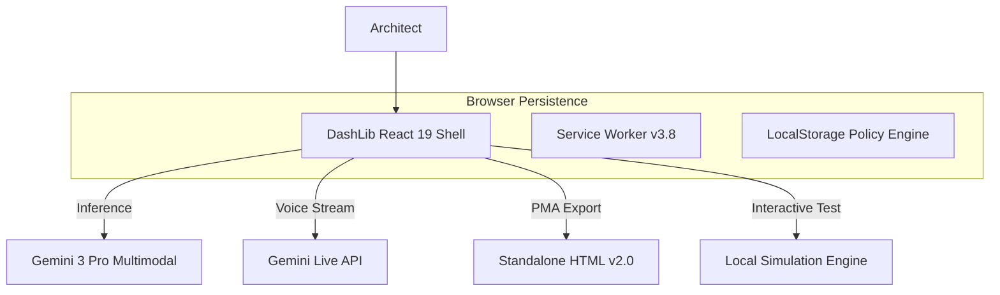

# 🏛️ System Architecture (v3.8)

DashLib AI is a client-centric, AI-augmented Single Page Application (SPA) designed for zero-install portability and multimodal intelligence.

---

## 1. High-Level System Context

```mermaid
graph TD
    User[Architect] --> UI[DashLib React 19 Shell]
    UI -->|Inference| Gemini[Gemini 3 Pro Multimodal]
    UI -->|Voice Stream| LiveAPI[Gemini Live API]
    UI -->|PMA Export| PMA[Standalone HTML v2.0]
    UI -->|Interactive Test| Sandbox[Local Simulation Engine]
    
    subgraph "Browser Persistence"
      UI
      SW[Service Worker v3.8]
      Storage[LocalStorage Policy Engine]
    end
```

## 2. Multimodal Synthesis Engine
The core intelligence layer supports three primary input vectors:
- **Textual Prompting**: Natural language descriptions of dashboard requirements.
- **Vision (OCR & Layout Analysis)**: Base64 image processing via Gemini 3 Pro to replicate UI hierarchies from screenshots.
- **Voice (Gemini Live API)**: Real-time PCM audio streaming with input transcription for hands-free generation.
- **Context Injection**: Direct mapping of SQL schemas or Figma JSON nodes to React component state and props.

## 3. Interactive Sandbox Engine (v3.8)
The application includes local simulation engines for validating dashboard logic before code generation.
- **Security Sandbox**: Uses a specialized state machine to generate random telemetry events. These events are validated against user-defined rules stored in `localStorage` to trigger visual alerts.
- **A/B Model Sandbox**: Simulates parallel API requests to multiple LLM providers, normalizing the mock response data for side-by-side charting.

## 4. The Portable Micro-App (PMA) v2.0 Strategy
- **React 19 Core**: The generated component is injected into a template optimized for React 19.
- **ESM Import Maps**: Resolves dependencies (React, Lucide, Recharts) via `esm.sh` at runtime, eliminating the need for local `node_modules`.
- **Babel Standalone**: Compiles JSX/TSX in the browser, allowing "Zero-Build" execution of the downloaded HTML file.
- **Tailwind JIT CDN**: Dynamically processes utility classes for the generated UI.

## 5. PWA Strategy: Resilience & Offline
The v3.8 Service Worker implements a robust **Stale-While-Revalidate** pattern:
- **Cache First**: Serves assets immediately from `dashlib-ai-v3.8`.
- **Background Update**: Fetches fresh assets and updates cache silently.
- **Navigation Fallback**: Reroutes all navigation requests to `/index.html` to support SPA routing offline.

---
© 2026 DashLib AI Ecosystem.
