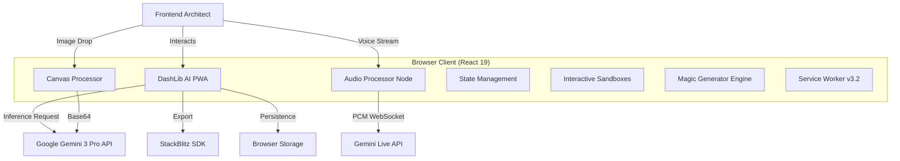
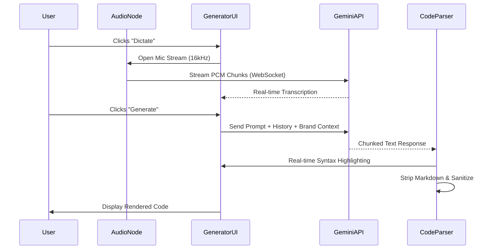

# 🏛️ System Architecture & Design

**DashLib AI** is a client-side first, AI-augmented Single Page Application (SPA) designed for high performance, offline capability, and enterprise-grade code synthesis. v3.2 introduces real-time multimodal capabilities.

---

## 1. High-Level System Context

## 2. Core Modules

### A. Inference Engine (`geminiService.ts`)
The brain of the application. It manages the context window, prompt injection, and response parsing.
- **Strategy**: Streaming responses for perceived latency reduction.
- **Multimodal**: Handles Text, Image (Base64), and Context inputs.
- **Constraint Injection**: Hard constraints (Tailwind, Lucide, Recharts) are prepended to every prompt.

### B. Audio Processing Module (`audioUtils.ts`)
Handles the bidirectional audio stream for Voice Architect.
- **Input**: Downsamples microphone input to 16kHz PCM (16-bit) for the Gemini Live API.
- **Output**: Decodes raw PCM chunks from the model into an `AudioBuffer` for low-latency playback (optional feedback).
- **Transport**: Uses WebSockets via `@google/genai` Live client.

### C. State Management
We utilize a hybrid persistence model:
- **React State**: Volatile UI state (modals, tabs).
- **`usePersistentState` Hook**: A wrapper around `localStorage` with JSON serialization/deserialization safety.

## 3. Data Flow Diagram (Multimodal Pipeline)

## 4. Architectural Decision Records (ADRs)

### ADR-001: Client-Side AI Calls
- **Context**: Should we proxy AI calls through a backend?
- **Decision**: No. Direct client calls reduce latency.
- **Trade-off**: API Key must be restricted via Referrer in Google Cloud.

### ADR-002: Tailwind CSS for Styling
- **Decision**: Tailwind CSS.
- **Reasoning**: LLMs are exceptionally proficient at generating utility classes.

### ADR-003: LocalStorage for Persistence
- **Decision**: LocalStorage.
- **Reasoning**: Zero-config, offline-first, privacy-preserving.

### ADR-004: Web Audio API for Voice
- **Context**: How to handle real-time voice?
- **Decision**: Native `ScriptProcessorNode` (or `AudioWorklet`) converting to PCM.
- **Reasoning**: Browser-native encoding avoids heavy external FFmpeg libraries. 16kHz PCM is the native format for Gemini Live.

### ADR-005: App Shell PWA Model
- **Context**: How to ensure offline routing works for an SPA?
- **Decision**: Service Worker intercepts all `navigate` requests and serves the cached `index.html`.
- **Reasoning**: This "Navigation Fallback" ensures that refreshing the page on a sub-route (e.g., `/?template=1`) works offline without needing server-side rewrite rules. We strictly separate the Shell (cached on install) from Content (cached via Stale-While-Revalidate).

## 5. Security Posture

- **Input Sanitization**: All AI outputs are treated as untrusted.
- **Microphone Permissions**: Requested only upon user action (Clicking "Dictate").
- **Memory Safety**: Audio contexts are strictly closed and garbage collected when the modal closes.
